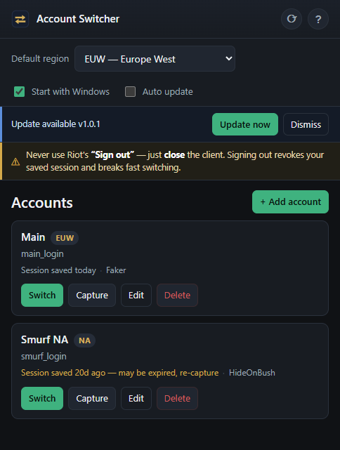

# League Account Switcher

A small, friendly Windows desktop app for switching between your League of Legends / Riot
accounts. It lives in the system tray: right-click to switch instantly, or open the window to
manage your accounts.

It reuses Riot's own **"Stay signed in"** session — for each account it saves an encrypted snapshot
of that session, then on a switch it closes the Riot Client, swaps the session in, and relaunches so
you land signed in without typing anything. If there's no usable saved session and you stored a
password, it can auto-type the login as a fallback.

> This is a standalone extract of the account-switching feature from
> [league-client-automation](../league-client-automation). It **shares the same account store**
> (`%AppData%\LeagueClientAutomation\accounts.json` and the per-account encrypted session snapshots),
> so accounts added in either app appear in both. Don't run a switch in both apps at the same time.



## Features

- 🗂️ Manage accounts: label, Riot username, optional password, region.
- ⚡ One-click switching from the window **or** the tray right-click menu.
- 💾 Capture & restore Riot's "Stay signed in" session for instant, no-typing sign-in.
- 🔑 Optional password auto-login fallback when a session is missing or expired.
- 🧲 Drag-and-drop reordering with collapsible **sections** to group accounts (window + tray).
- 🌍 Region selector with a configurable default (EUW by default).
- 🛡️ Live-game guard — won't close champ select / a running game unless you force it.
- 🔗 Quick links for the signed-in account: **Porofessor** (live game) and **OP.GG** (profile).
- ✅ **Auto Accept** — accepts any queue's ready check after a delay you choose (0–10s).
- 🕶️ **Appear Offline** — log in with League chat set to offline (open eye = online, slashed gold eye = offline).
- ⚙️ **Sync settings across accounts** — carry your keybinds, camera & video/audio settings to every
  account.
- 🚀 Start with Windows (to the tray), close-to-tray.
- 🔄 Auto-update from GitHub Releases — checks on launch and every 10 min; shows an update banner
  (or updates fully automatically when **Auto update** is enabled).
- ❓ Built-in help guide.

## In-game helpers

The toolbar (top-right) and settings strip add three optional helpers that talk to the running League
client locally over `127.0.0.1`:

- **Auto Accept** (text button, green = on / red = off). A global toggle that auto-accepts *any* queue's
  ready check. It waits **Auto accept after** seconds (settings strip; default 2, `0` = as soon as
  possible, max 10) before accepting, and polls more frequently while you're in matchmaking so the pop
  is caught quickly. Stays on until you turn it off.
- **Appear Offline** (eye icon — open eye when online, slashed gold eye when appearing offline). Sets
  League chat to offline.
  Turn it on while signed in and the current account goes offline until your next switch; turn it on with
  no client running and it arms for the **first** account you switch to. Switching while it's on reverts
  to online, so the next account logs in normally.
- **Sync settings across accounts** (settings strip toggle). Keeps your `game.cfg`, `input.ini` and
  `PersistedSettings.json` — i.e. keybinds, camera, mouse, video/audio — the same on every account.
  League stores these server-side per account and overwrites them on login; this app snapshots one
  **baseline** and re-applies it across each switch (briefly making the files read-only so the login
  sync-down can't clobber them, then releasing the lock so you can still change settings). Use
  **Update baseline** after changing your settings to save the new set. Rune pages and item sets are
  left per-account on purpose.

## Security

Passwords and captured sessions are encrypted with **Windows DPAPI** (CurrentUser scope) — readable
only by your Windows user on this machine, and never uploaded anywhere. The app talks only to the
Riot Client and League client running locally on `127.0.0.1`.

## Requirements

- Windows 10/11
- League of Legends / Riot Client installed
- For development: Node.js 20+ (built with Node 24)

## Develop

```sh
npm install
npm start      # run the app in dev
npm test       # run unit tests (node --test)
```

Useful env overrides for testing without touching your real install:
`LCA_CONFIG_DIR`, `LCA_RIOT_SESSION_FILE`, `LCA_RIOT_LOCKFILE`, `LCA_RIOT_CLIENT_EXE`, `LCA_LEAGUE_PATH`.

**Logs / debugging other PCs:** the app writes a diagnostic log (startup paths, switch progress) to
`%AppData%\LeagueClientAutomation\switcher.log`, pruned to the last 3 days. Open it from the tray
menu → **Open logs**. If a friend has trouble, have them send that file. The League install path is
auto-detected from `RiotClientInstalls.json`; override with `LCA_LEAGUE_PATH` if needed.

## Build (Windows installer)

```sh
npm run dist   # builds the NSIS installer into dist/ (no publish)
npm run pack   # unpacked build (faster, for quick checks)
```

Only the **NSIS installer** is built (the portable build was dropped — it can't auto-update).

## Releasing (auto-update)

Auto-update uses [`electron-updater`](https://www.electron.build/auto-update) against this repo's
**GitHub Releases**, so the repo must stay **public**. Each release needs the installer **plus**
`latest.yml` and the `.blockmap` — `npm run release` builds and uploads all three for you:

```sh
# 1. bump the version (this is what update checks compare against)
npm version patch        # 1.0.0 -> 1.0.1

# 2. publish: builds the installer + latest.yml + .blockmap and publishes a live GitHub release
$env:GH_TOKEN = "<a GitHub token with repo scope>"
npm run release
```

`releaseType: release` in the publish config means it goes **live immediately** (no draft to publish
by hand). Installed apps then pick it up automatically (on launch / every 10 min), or via the ⟳
**Check for updates** button. With **Auto update** on, they download and restart on their own. Auto-update only
runs in the **installed** app, not in `npm start`.

Icons are generated from code (no binary assets in git):

```sh
node build/generate-icons.mjs   # writes src/assets/*.png and build/icon.ico
```

### If `npm start` says "Electron failed to install correctly"

`node_modules/electron/dist` is missing `electron.exe` (often only `LICENSES.chromium.html` is there).
Two things conspire on some Windows setups: npm's allow-scripts gate skips Electron's postinstall
(`npm warn allow-scripts ... electron`), and even when run, Electron's bundled extractor (`extract-zip`)
silently fails on Node 24 (`dist/` ends up with just the license file, exit 0, no error).

Fix — extract it with PowerShell instead (uses the cached download or fetches it):

```sh
npm run fix-electron   # then: npm start
```

(Re-run `npm run fix-electron` after any fresh `npm install`, since the binary won't be re-extracted.)

### If `npm run dist` fails on "Cannot create symbolic link" (winCodeSign)

electron-builder downloads `winCodeSign`, whose archive contains macOS `.dylib` *symlinks*.
Extracting symlinks on Windows needs the "create symbolic link" privilege, so a normal user hits
`A required privilege is not held by the client`. (We aren't signing — builder fetches it anyway.)

Fix either way:

- Run `npm run dist` from an **elevated** PowerShell (Run as Administrator), **or**
- Enable **Developer Mode** (Settings → System → For developers → Developer Mode = On), then build
  normally.

> The app itself still packages fine — `dist\win-unpacked\League Account Switcher.exe` is produced
> before this step and is runnable directly.

## How to use

1. **Add account** → label, Riot username, (optional password), region.
2. Sign in to that account in the Riot Client **with "Stay signed in" checked**.
3. Press **Capture** — it closes the Riot Client to save a valid session.
4. From then on, **Switch** (window or tray) signs you in with one click.

> ⚠️ **Never use Riot's "Sign out"** — just close the client. Sign-out revokes the session on Riot's
> servers and breaks the saved session. If that happens, sign in again and press **Capture**.

Saved sessions expire in ~1–3 weeks; re-capture when a card shows "may be expired".

## Project layout

```
src/
  core/        # the switching engine (ported from league-client-automation; shared store)
  main/        # Electron main: lifecycle, window, tray, IPC, status streaming
  preload/     # contextBridge -> window.api
  renderer/    # the app window UI (HTML/CSS/JS)
  help/        # the help guide window
  assets/      # generated runtime icons
build/         # icon generator + build/icon.ico
test/          # unit tests for the pure modules
```
 